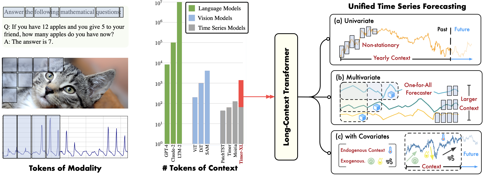
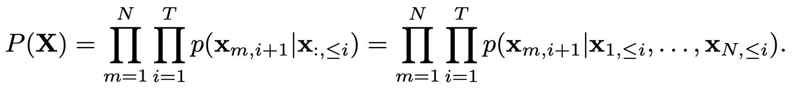
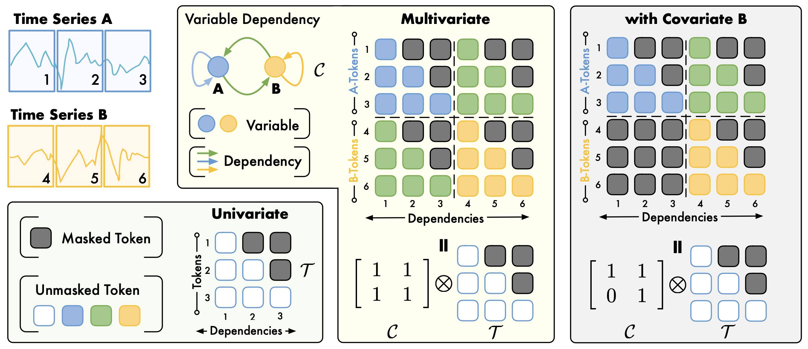
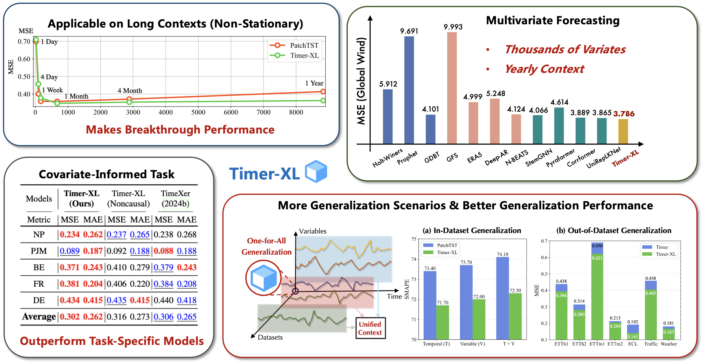

# Timer-XL

Timer-XL: Long-Context Transformers for Unified Time Series Forecasting [[Paper]](https://arxiv.org/abs/2410.04803).

:triangular_flag_on_post: **News** (2025.01) Timer-XL has been accepted as **ICLR 2025**. See you at Singapore :)

:triangular_flag_on_post: **News** (2024.12) Released a univariate pre-trained model [[HuggingFace]](https://huggingface.co/thuml/timer-base-84m). An quickstart usage is provided [here](https://github.com/thuml/Large-Time-Series-Model/blob/main/examples/quickstart_zero_shot.ipynb).

:triangular_flag_on_post: **News** (2024.10) Model implementation is released in [[OpenLTM]](https://github.com/thuml/OpenLTM).

## Introduction

Timer-XL is a generative Transformer for time series forecasting. It can be used for task-specific training or scalable pre-training, handling arbitrary-length and any-variable time series.

<p align="center">

</p>

💪 Various forecasting tasks can be formuled as a long-context generation problem, which can be well addressed by generative Transformers.

💡 We propose **multivariate next token prediction**, a paradigm to uniformly predict univariate and multivariate time series with optional covariates. 

🌟 We pre-train Timer-XL, a long-context version of time-series Transformers ([Timer](https://github.com/thuml/Large-Time-Series-Model)), for zero-shot forecasting.

🏆 Timer-XL achieves **state-of-the-art** performance as a one-for-all time series forecaster.

## What is New

> For our previous work, please refer to [**Tim**e-Series-Transform**er** (Timer)](https://github.com/thuml/Large-Time-Series-Model)

### Model Architecture

| Time-Series Transformers | [PatchTST](https://github.com/PatchTST/PatchTST) | [iTransformer](https://github.com/thuml/iTransformer) | [Moirai](https://github.com/SalesforceAIResearch/uni2ts) | [Timer](https://github.com/thuml/Large-Time-Series-Model) | [Timer-XL (Ours)](https://github.com/thuml/OpenLTSM) |
| ------------------------ | ------------------------------------------------ | ----------------------------------------------------- | -------------------------------------------------------- | --------------------------------------------------------- | --------------- |
| Generative               | No                                               | No                                                    | No                                                       | Yes                                                       | **Yes**         |
| Intra-Series Modeling    | Yes                                              | No                                                    | Yes                                                      | Yes                                                       | **Yes**         |
| Inter-Series Modeling    | No                                               | Yes                                                   | Yes                                                      | No                                                        | **Yes**         |

## Generalize 1D Sequences to 2D Time Series

### Multivariate Next Token Prediction

We generalize next token prediction for multivariate time series. **Each prediction is made based on tokens of the previous time from multiple variables**:

<p align="center">

</p>

### Universal TimeAttention

We design TimeAttention, a causal self-attention allowing intra- and inter-series modeling while maintaining the causality and flexibility of generative Transformers. It can be applied to univariate and covariate-informed contexts, enabling **unified time series forecasting**.

<p align="center">

</p>

## Main Results

<p align="center">

</p>

## Citation

If you find this repo helpful, please cite our paper. 

```
@article{liu2024timer,
  title={Timer-XL: Long-Context Transformers for Unified Time Series Forecasting},
  author={Liu, Yong and Qin, Guo and Huang, Xiangdong and Wang, Jianmin and Long, Mingsheng},
  journal={arXiv preprint arXiv:2410.04803},
  year={2024}
}
```

## Acknowledgment

We appreciate the following GitHub repos a lot for their valuable code and efforts:

- Time-Series-Library (https://github.com/thuml/Time-Series-Library)
- Large-Time-Series-Model (https://github.com/thuml/Large-Time-Series-Model)
- AutoTimes (https://github.com/thuml/AutoTimes)

## Contact

If you have any questions or want to use the code, feel free to contact:

* Yong Liu (liuyong21@mails.tsinghua.edu.cn)
* Guo Qin (qinguo24@mails.tsinghua.edu.cn)
